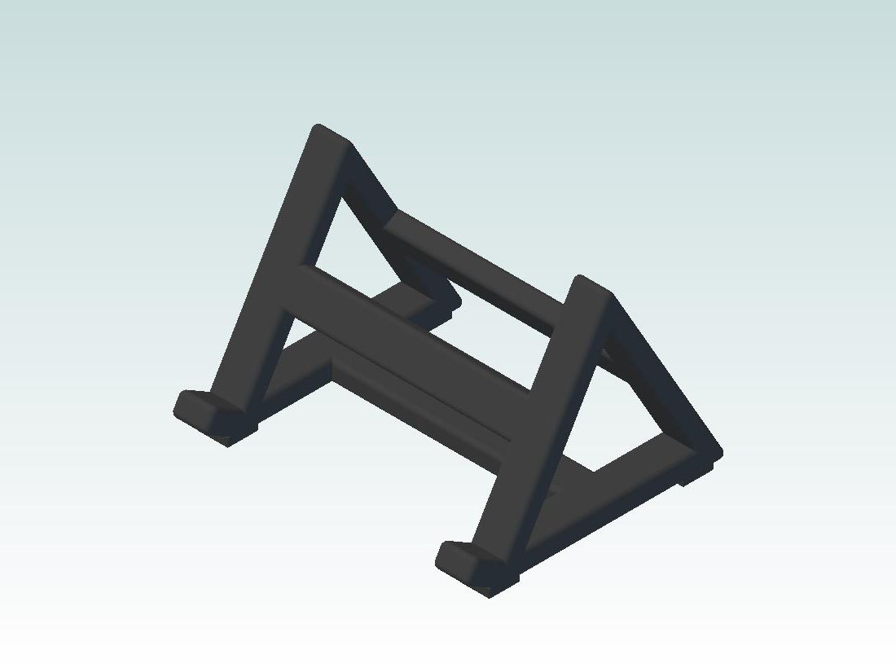

# PH1 - Phone Holder

The PH1 phone holder is designed to hold a cell phone in the landscape position
when placed on a flat surface like a desk or table.



## Specifications

```text
Length: 3.4"
Width: 4"
Height: 2.8"
```

## Bill Of Materials

| Qty | Description |
| --- | --- |
| 1 | 3D printed PH1 phone holder |
| 4 | 3/8" square rubber foot |
